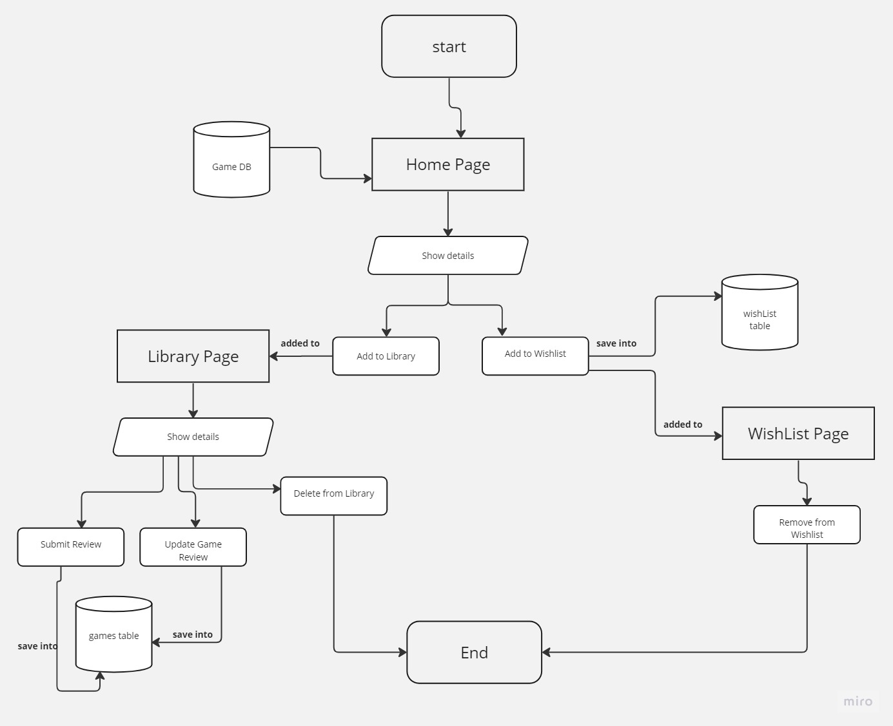

# Prep_Project_-4

# What is the vision of this product:
Gaming Zone Project Aims to offer intertainment and joyful for users which is full of exiting and interaction Games.

Letting users to add favourite games to their Library or to wishList if they desire to purchase it

# What pain point does this project solve?
Every one needs an intertainment tool to enjoy and play with friends over the network.
Game-zone app intend to fill this need by broviding a software allows entertainment over the netwok

# Why should we care about your product?
Bring joyfull just at first sight “very good design”
Easy to use app .

# Scope (In/Out)
* IN - What will your product do
    The game-zone app will provide information to the users about all the different games in the website
    The game-zone app will provide both add to Library and add to wish list for each game.
    Users will be able to "update" their Reviews for a specific game.
    Each user will be able to review and buy a game.
* OUT - What will your product not do.
Game-zone will never use GPS.
Game-zone will never turn into an IOS or Android app.

# Minimum Viable Product

A home page displaying games under different categories. A search bar to search for games. The ability for users to add games to their library or wishlist. The ability for users to write reviews for the games they have played. Styling to make the application user-friendly and visually appealing.
Minimum Viable Product
What will your MVP functionality be?
What are your stretch goals?
Stretch
What stretch goals are you going to aim for?
Gaming Zone Project Aims to offer intertainment and joyful for users which is full of exciting and interaction Games.
Functional Requirements
1.    The user can add games to wishList and Library 
2.    The user can delete games from wishList and Library 
3.    A user can update game reviews.
4.    A user can show all of the games in the app.

# Data Flow Image 

# Non-Functional Requirements
* Security:
This app does not create profile for users,it doesnot need to access user credentials.
Therefore,security is not a concern in this application

* Availability:
1.    System should be available 24 hours per day,7 days per week.
2.    In case of an unexpected error failure in the system such as server connection problem ,system inform users and doesn’t allow them to continue